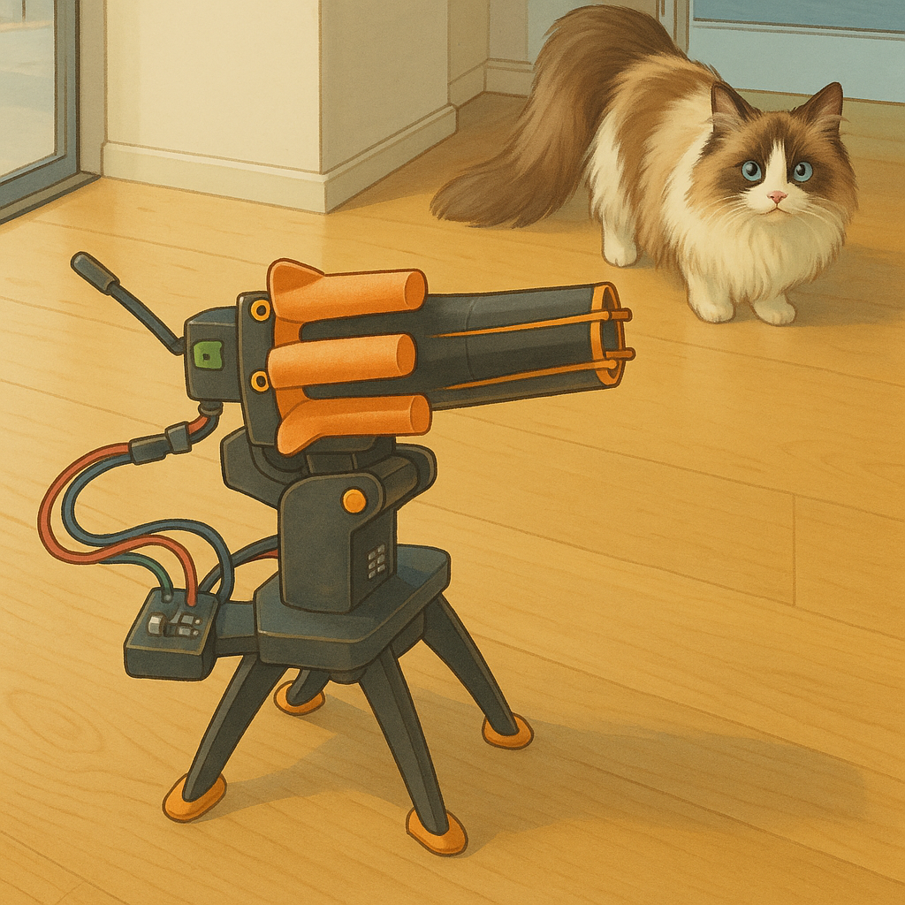

# Turret Controller MCP Server

## Description

This project is an MCP (Model Context Protocol) server that controls a turret using serial communication. It exposes tools to:




*   Fire the turret
*   Set the turret's position (pan and tilt)
*   Get the current number of bullets

## Usage

This server exposes tools that can be accessed via an MCP client.

### Tools

*   **fire**: Fires the turret.
*   **set_turret_position**: Sets the turret's position. Requires `x` and `y` coordinates (0-180).
*   **get_bullets**: Gets the current number of bullets.
*   **echo**: Repeat what you say.

## Installation

1.  Make sure you have Rust installed. If not, install it from [https://www.rust-lang.org/](https://www.rust-lang.org/).
2.  Clone the repository.
3.  Navigate to the project directory.
4.  Run `cargo build -r` to build the project.
5.  MCP Agent Plugin node require config_json like this to command or URL to connect MCP servers
```json
{
  "mcpServers": {
    "turret": {
      "command": "/path/to/turret_mcp_server/target/release/turret_mcp_server",
      "alwaysAllow": [
        "set_turret_position",
        "get_bullets",
        "fire"
      ]
    }
  }
}
```
6. Connect the turret to USB

## How to use
In chat context you can simple write: 
`turn the turret left, then right and shoot`


### Serial Port Configuration

The server uses the `/dev/ttyUSB0` serial port by default. You may need to modify the [turret_mcp_server.rs](src/turret_mcp_server.rs) file to use the correct serial port for your system.

### Dependencies

The project uses the following dependencies:

*   `anyhow`
*   `rmcp`
*   `serialport`
*   `serde_json`
*   `tracing_subscriber`

These dependencies are managed by Cargo, the Rust package manager.